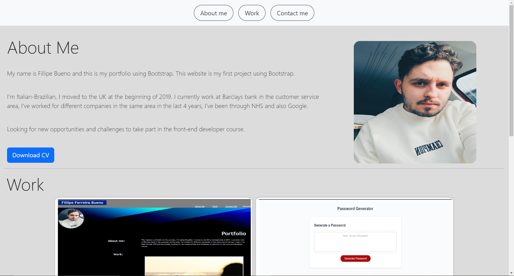

# Challenge 3 Portfolio using Bootstrap.

## This Project aim to show and practice some features of Bootstrap and CSS.

This project was carried out using HTML, CSS and Bootstrap, the main goal of the project was to create a portfolio that has a clean UI and functional as possible. All buttons and images apart from the download CV and profile picture are 100% fuctional.

### Website Interface Image:

